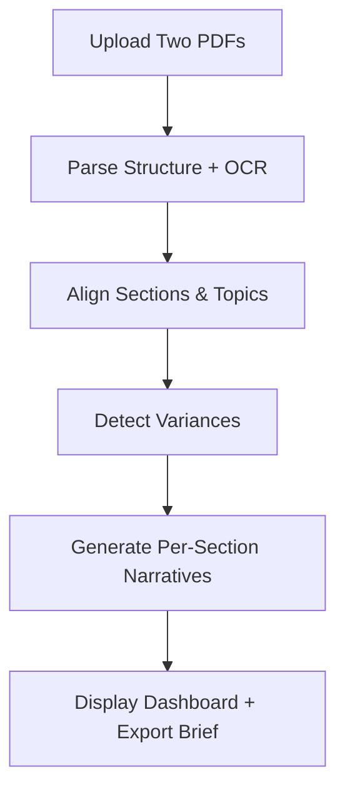

# 🧭 Olympia BoD Analyzer – Product Vision Deck (MVP 2025)

## Slide 1 — The Pain: “The 80-Page BoD Bottleneck”
- **Context:** Olympia Group receives 80-page Board of Directors (BoD) presentations from each portfolio company every quarter.
- **Problem:** They arrive 1-2 days before meetings, leaving almost no time for thorough review.
- **Manual effort:** Analysts read both current and previous decks, taking notes, cross-referencing goals, and tracking progress manually.
- **Outcome:** Hours of labor, high cognitive load, and inevitable oversights.
- **Quote:** “We spend more time reading slides than thinking strategically.”

## Slide 2 — The Stakes: “Decisions Made Blind = Risk”
- Board members base multi-million-euro decisions on incomplete understanding of what changed between quarters.
- Subtle shifts in wording (from “will complete” → “aim to complete”) or disappearing topics often go unnoticed.
- Missing these details can mask strategic or financial problems until too late.
- **Impact:** The difference between “hope” and “will” can cost millions.

## Slide 3 — The Current Reality
- **Manual workflow:**
  - Receive two 80-page PDFs.
  - Read both end-to-end.
  - Annotate by hand, compare line-by-line.
  - Double-check numbers and statements.
  - Summarize findings for the BoD meeting.
- **Pain points:**
  - Time-consuming and inconsistent.
  - Error-prone and mentally draining.
  - No single source of truth across quarters.

## Slide 4 — The Opportunity: “Turn Information Overload into Clarity”
- What if the process could be transformed into a 15-minute review that shows exactly:
  - What changed since last quarter.
  - Which commitments were delivered, delayed, or quietly dropped.
  - How confident (or uncertain) management sounds.
  - Where numbers or narratives don’t match up.
- **Transformation:** From reading slides → to reading reality.

## Slide 5 — The Solution: Olympia BoD Analyzer
- An AI-powered web app that:
  - Uploads two consecutive BoD PDFs.
  - Automatically aligns sections (even if structure changed).
  - Extracts and compares text, tables, and visuals.
  - Highlights key differences and sentiment shifts.
  - Generates a concise, per-section summary with references.
- **Output:** A single dashboard that shows — at a glance — what deserves the board’s attention.

## Slide 6 — How It Works (System Flow)

- **AI Tasks:**
  - Financial Diff Engine: Extract numbers, compute % change, detect screenshot tables.
  - Commitment Tracker: Find promises vs. outcomes.
  - Tone Analyzer: Highlight softened/confident language.
  - Omission Detector: Flag missing topics.

## Slide 7 — What It Finds (Example from Westnet)
| Type               | Example                                               | Detection            |
|--------------------|------------------------------------------------------|----------------------|
| Numeric Variance    | EBITDA margin ↓ from 9% → 6%                        | Table comparison      |
| Tone Change         | “Will launch new hub” → “Plan to launch new hub”    | Verb softening        |
| Commitment Shift    | Q2 promise: “Hire 50 tech staff” → Q3: “Restructuring hiring plans” | Cross-quarter link    |
| Omission            | “Digital Transformation” section removed             | Topic absence         |
| Narrative Output    | “Profitability improved slightly but management confidence moderated regarding expansion timelines.” | AI summary           |

## Slide 8 — The Experience
- **UI Layout (Option C):**
  - **Top Panel:** “AI Summary” — per-section narratives and metrics.
  - **Bottom Panel:** Side-by-side diff viewer with color highlights (green = added, red = removed, orange = tone change).
  - **Hover Tooltips:** “Slide 12 → Financial Overview → paragraph 2.”
  - **Export Button:** “Generate Meeting Brief (PDF).”
- **Design Tone:** Minimal. Executive. Quiet authority. No gimmicks — just intelligence presented elegantly.

## Slide 9 — The Impact
| Metric                                   | Baseline      | Target         |
|------------------------------------------|---------------|----------------|
| Time to prepare for BoD meeting         | 5-6 hours     | ≤ 2 hours      |
| Accuracy vs manual review                | —             | ≥ 80%          |
| Executive trust in AI output             | —             | 4.5/5 feedback  |
| “Missed insights” surfaced               | —             | At least 1 per test set |

- **Outcome:** Saves time, reveals blind spots, and earns executive trust.

## Slide 10 — Roadmap
- **Phase 1 (MVP – Current Scope):**
  - Financials focus (tables + tone + commitments + omissions).
  - Per-section summaries + citations.
  - Manual upload.
  - Local/private cloud deployment.
- **Phase 2:**
  - Multi-quarter timeline tracking.
  - Interactive variance visualizations.
  - Memory for each portfolio company.
- **Phase 3:**
  - Integration with data rooms, emails, and BoD calendars.
  - Fully on-prem AI assistant for the entire Olympia Group ecosystem.

## Slide 11 — Vision
- Olympia BoD Analyzer becomes the intelligence layer between portfolio companies and the holding company — transforming static presentations into living insights.
- **Benefits:**
  - Builds institutional memory over time.
  - Detects risks early.
  - Helps leadership focus on what truly matters.
- **Quote:** “From 80 pages of slides to 1 page of truth.”

## Slide 12 — MVP Architecture Snapshot
- **Frontend:** React + Tailwind (two-pane UI)
- **Backend:** FastAPI (Python)
- **LLM Engine:** GPT-4-Turbo for text analysis & summaries
- **OCR & Parsing:** PyMuPDF + Tesseract
- **Storage:** SQLite (local)
- **Deployment:** Docker (local or private cloud)
- **Privacy:** PDFs stay on-prem, deletable post-session

## Slide 13 — MVP Deliverables
- Upload & parse two PDFs.
- Align and compare sections.
- Highlight numerical, textual, and tonal differences.
- Generate per-section narrative with citations.
- Web dashboard with summary + side-by-side diff.
- Exportable “Meeting Brief” PDF.

## Slide 14 — Success Statement
- **Outcome:** Olympia management walks away saying:
  - “This actually helps us understand the reports and get prepared for the meeting faster.”
